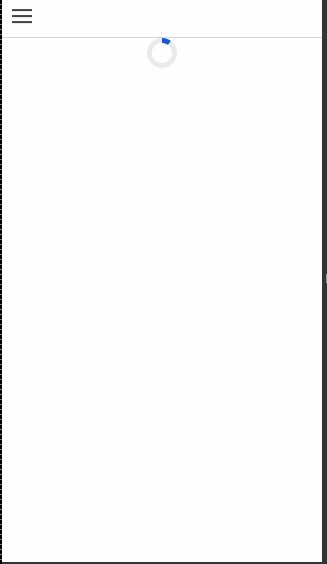
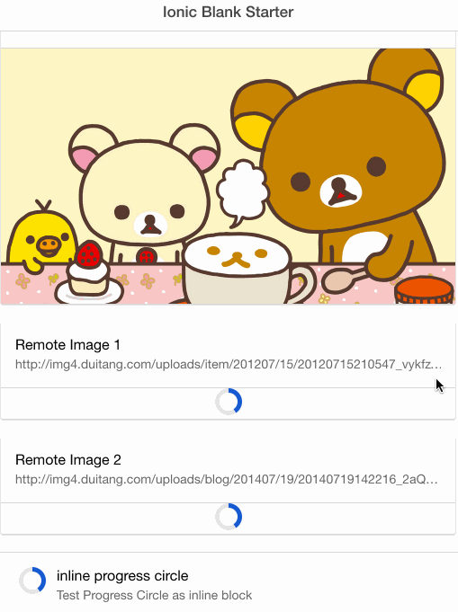
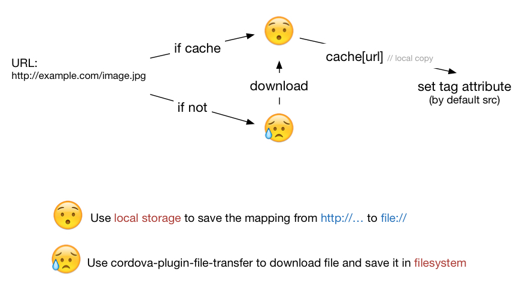

# NOTICE

I will try to spare my time to work on a ionic2 version in typescript. 

in the 0.7.2

- Add encode option for URI
- Roll back `watch` to `observe`
- Find `java.io.EOFException` issue for old android causing the fileTransfer failed, if so don't cache.


in the 0.7.0

- Now support Video and Audio Tag
- Fix Bugs from several issues
- Add more examples
- Demo and Example: https://github.com/BenBBear/ionic-cache-src-demo
  - Ng-repeat
  - Collection Repeat 
  - Video


# ionic-cache-src

Just change `src` to `cache-src`
```html
    

```

and it will take the rest work for you.


## Demo


### simple




### complex




## Install


- bower 

```shell
bower install ionic-cache-src
```

- it depends on [ngStorage](https://github.com/gsklee/ngStorage), [ngCordova](http://ngcordova.com/), [angular-svg-round-progress](https://github.com/crisbeto/angular-svg-round-progressbar) so you have to load them both in you `index.html`


```html
<script src="lib/ngCordova/dist/ng-cordova.min.js"></script>
<script src="cordova.js"></script>
<script src="cordova_plugins.js"></script> <!-- This one is optional -->
<script src="lib/ngstorage/ngStorage.min.js"></script>
<script src="lib/angular-svg-round-progressbar/build/roundProgress.min.js"></script>
<script src="lib/ionic-cache-src/ionic-cache-src.js"></script>
```

- and it use [cordova-plugin-file-transfer](https://github.com/apache/cordova-plugin-file-transfer) and [cordova-plugin-file](https://github.com/apache/cordova-plugin-file), so

```shell
cordova plugin add cordova-plugin-file cordova-plugin-file-transfer
```

- add `ionic-cache-src` to your angular module declaration dependencies

```js
angular.module('myApp', ['ionic','ionic-cache-src'])
```

- Done


## How it Work

very simple strategy




<br>
<br>


## Usage

### Custom the progress circle

it accepts all options for [angular-svg-round-progressbar](https://github.com/crisbeto/angular-svg-round-progressbar) , except for `current`

### Change src

```html

```
will be rendered to

```html

```

not so useful though.


### Background image

```html
<div  cache-src="http://farm4.static.flickr.com/3131/2877192571_3eb8bcf431.jpg"
src-is="background" >
<!-- stuff -->
</div>
```


### Video

```html
<video id="video" width="400"  controls  cache-src="http://vjs.zencdn.net/v/oceans.png" src-is="poster">
    <source cache-src="http://vjs.zencdn.net/v/oceans.mp4" type="video/mp4">
        Your browser does not support HTML5 video.
</video>
```


### Expire

```html

```
Set expiration time to 60 seconds. At the next page load and directive linking, this cache will be renewed if 60s passed. But there wouldn't be progress circle, the image will be replaced after the newly downloaded file is ready.


The expiration time is `Infinity` by default.


### EncodeURI

```html
    
```

CordovaFileTransfer encodes URL by default, but some urls don't need. See this issue [#17](https://github.com/BenBBear/ionic-cache-src/issues/17)


#### Custom background style

```html
<div  cache-src="http://farm4.static.flickr.com/3131/2877192571_3eb8bcf431.jpg"
src-is="background"
background-style="no-repeat center"
background-loading-style="url('path/to/your/loading/image.gif') no-repeat center"
>
<!-- stuff -->
</div>
```
- `background-style` will be used as

```html
<div style="background:url('image/url') {{backgroundStyle}}">
<!-- stuff -->
</div>
```

- Default `background-loading-style` is `url('lib/ionic-cache-src/img/loader.gif') no-repeat center`


### Inline progress circle

By default the progress circle is a block div, here is source code.

```js
function makeProgressCircle($scope, $compile) {
    return angular.element($compile('<div style="{{circleContainerStyle}}"><div round-progress  max="max"  current="progress"  color="{{color}}" bgcolor="{{bgcolor}}"  radius="{{radius}}"  stroke="{{stroke}}"  rounded="rounded" clockwise="clockwise" iterations="{{iterations}}"  animation="{{animation}}"></div></div>')($scope));
};
```

So you could change its style using `circleContainerStyle`

```html
<div class="list">
    <a class="item item-avatar" href="#">
        
        <h2>inline progress circle</h2>
        <p>Test Progress Circle as inline block</p>
    </a>
</div>
```


### Callback

```html

```

```js
function onError(err){}
function onStart(originUrl){}
function onFinish(naiveUrl){}
function onProgress(number){}
```

Note that the `OnProgress` and `OnStart` will only be called if a download is needed.

### Work in broswer

It will works in browser with a mock download process.


### For local file path

> The plugin will download and cache the file if the url is `http`, `https` or `ftp`, otherwise it won't.

So it works for local file path, or base64 etc...


### Service

This plugin store cache info as  `$localstorage.cache_src = {RemoteUrl:LocalUrl}`, and there is a factory you could used to access the cache:

```js
module.controller('Ctrl', function(cacheSrcStorage) {
    cacheSrcStorage.get('url') // === the local cache path for 'url'
});
```
which you can use to access the cached file


### Config

```js
module.config(function($cacheSrcProvider){
    $cacheSrcProvider
              .set('key',value)
              .set({key:value}); // set option
})

```
Key, Value for options like

- `srcIs` 
- `onError` for global use etc...
- `showProgressCircleInBrowser` whether show progress circle in browser
- `showProgressCircleInDevice` whether show progress circle in device
- `interval` browser mock progress circle period, by default 200.
-  options for progress circle  [angular-svg-round-progressbar](https://github.com/crisbeto/angular-svg-round-progressbar)

- `backgroundStyle` and `backgroundLoadingStyle`
- `circleContainerStyle`
- `expire`
- Anything you like, if you use custom progress indicator.

Note that the in-tag config has the higher priority than  `$cacheSrcProvider`


### Use custom progress indicator instead of built-in progress circle

Use callback

```
uiOnStart, uiOnProgress, uiOnFinish
```

You could take reference of the default source of this three functions, which implements the progress circle, and write your custom progress indicator.


To use your own uiOn* functions

```js
module.config(function($cacheSrcProvider){
    $cacheSrcProvider
              .set('uiOnStart', myUiOnStart)
              .set('uiOnProgress', myUiOnProgress)
              .set('uiOnFinish', myUiOnFinish);
}); 
```


<br>
<br>
<br>


## Attention


### cordova_plugins.js

Because of https://github.com/driftyco/ionic-plugin-keyboard/issues/82 , the `ionicPlatform.ready` may fail from exception. If you encounter this problem, Add 

```html
<script src="cordova_plugins.js"></script>
```

solve it.


#### android:cordova-plugin-file

For android, you may need to add this 

```xml
<preference name="AndroidPersistentFileLocation" value="Internal" />
```

to your config.xml, as mentioned in [#10](https://github.com/BenBBear/ionic-cache-src/issues/10).  Otherwise the image won't be loaded, and no error `console.log`.


#### livereload

> When using live reload, you’re actually running the assets off the computer and not the device

You will get an error: `Not allowed to load local resource`, but it will only occur when livereloading.


#### iOS 9 NSAppTransportSecurity

Because iOS 9 forbids arbitrary http request, you may add

```xml
<key>NSAppTransportSecurity</key>
<dict>
    <key>NSAllowsArbitraryLoads</key><true/>
</dict>
```

to you `.plist` file. Details in this gist: https://gist.github.com/mlynch/284699d676fe9ed0abfa


